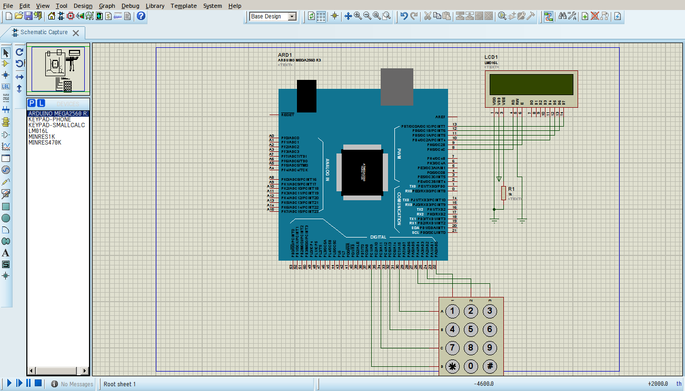
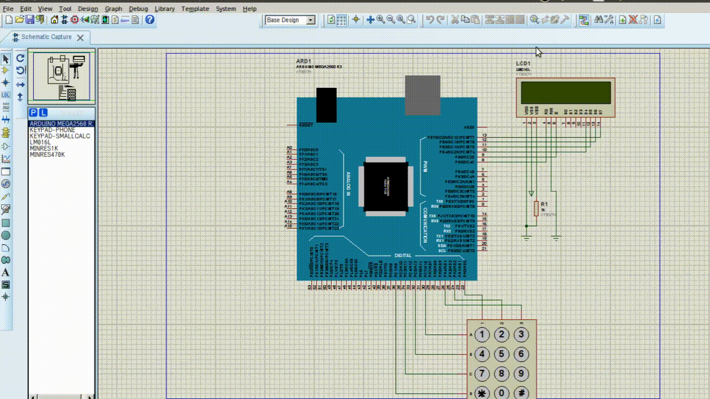

# LabElectronica
Simula el acceso a un menú de un Laboratorio de Electrónica, usando Proteus(Simulación) y Arduino(IDE).

## ¿Cómo funciona?
### Versión 1.1

El código está desarrollado en Arduino(IDE), probado y simulado en Proteus. Los elementos visuales son: Arduino Mega 2560 R, Display LM016L (Pines: 8,9,10,11,12,13), Resistencia 1k ohmios y teclado KeyPad-Phone 4x4 (pines(Rows): 30,32,34,36 y Pines(Columns):22,24,26,28). (Imagen-1)

.

## Ejemplo del funcionamiento
Al iniciar la simulación muestra una bienvenida, luego pide un password y inicia el menú de diseño o Administrador. La versión 1.1 permite modificar el password del usuario y lo guarda en la memoria interna EEPROM del Arduino (Imagen-2)

